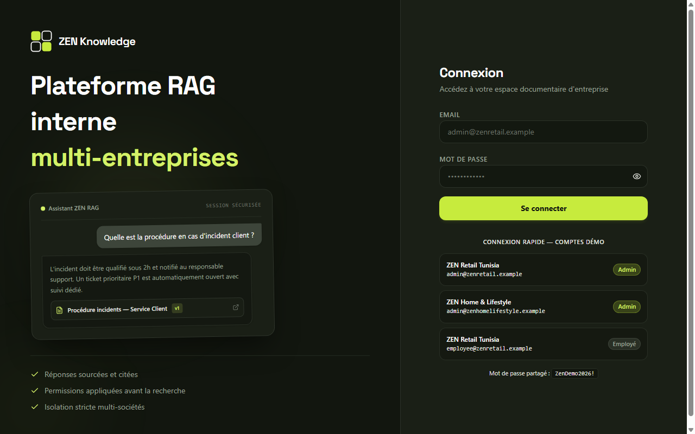
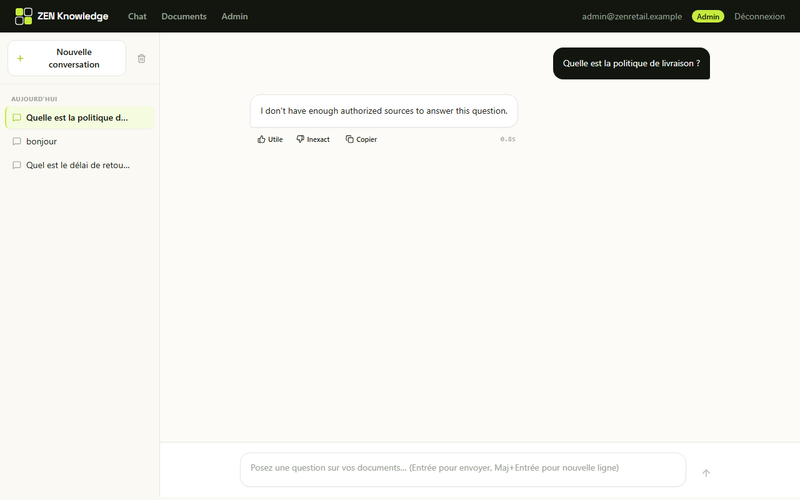
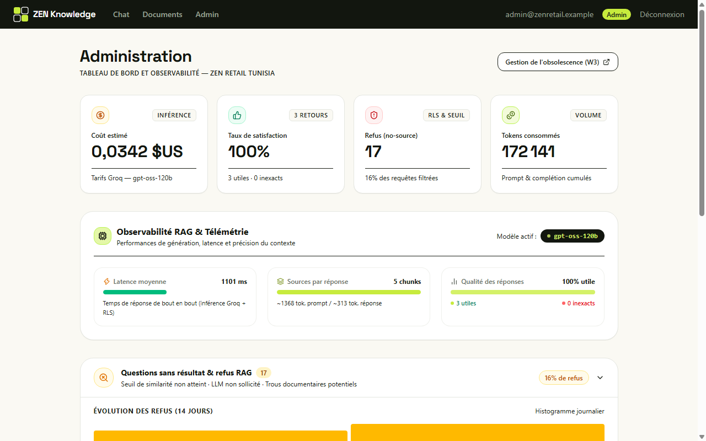

# ZEN Knowledge

Projet de test technique — **ZEN Group, Série F, F1 : "ZEN Knowledge — RAG interne"**.

Plateforme conversationnelle interne multi-entreprises permettant aux collaborateurs d'interroger les documents de leur entreprise via un système RAG (Retrieval-Augmented Generation) hautement sécurisé.

Le système résout le problème de l'accès cloisonné et sécurisé à l'information documentaire en entreprise : isolation stricte entre filiales (multi-tenant), permissions granulaires (par rôle, département et niveau de visibilité), versioning documentaire traçable, citations cliquables et vérifiables, gestion du cycle de vie et de l'obsolescence des documents, et observabilité complète pour les administrateurs.

## Aperçu de l'interface

| Connexion & Multi-tenant | Chat RAG & Citations dépliées | Administration & Observabilité |
|:---:|:---:|:---:|
|  |  |  |

## Démo vidéo

Lien : [Voir la vidéo de démonstration](https://drive.google.com/file/d/1YsSWrdFsn6Fx9m6xCKQpnpstcyD6-6T-/view?usp=sharing)
## Tester en 2 minutes

**Application déployée** : https://zen-knowledge.vercel.app  
**Page de connexion** : https://zen-knowledge.vercel.app/login — la page propose des boutons de connexion rapide pour les comptes ci-dessous (un clic, aucun mot de passe à copier).

| Entreprise | Rôle | Email | Mot de passe |
|---|---|---|---|
| ZEN Retail Tunisia | Admin | `admin@zenretail.example` | `ZenDemo2026!` |
| ZEN Retail Tunisia | Employé | `employee@zenretail.example` | `ZenDemo2026!` |
| ZEN Home & Lifestyle | Admin | `admin@zenhomelifestyle.example` | `ZenDemo2026!` |

### Preuve d'isolation — scénarios de test croisés

Le document "Rapport financier confidentiel — T4 2025" existe réellement en base, publié chez **ZEN Home & Lifestyle** uniquement.

1. **Isolation inter-entreprises (cross-company)** : Connectez-vous en **ZEN Retail Tunisia** (admin) → demandez *"Quel est le chiffre d'affaires du dernier trimestre ?"* → **refus**, alors que l'information existe en base chez l'autre entreprise.
2. **Accès légitime** : Reconnectez-vous en **ZEN Home & Lifestyle** (admin) → posez exactement la même question → **réponse sourcée avec citation cliquable**.
3. **Isolation intra-entreprise par rôle** : Connectez-vous en **ZEN Retail Tunisia — Employé** → demandez la grille salariale 2026 (document `restricted`, propre à sa société) → **refus**, prouvant que le filtrage descend jusqu'au rôle et au niveau de visibilité, pas seulement à l'entreprise.

Dans les trois cas de refus, le message est strictement identique (`"Je n'ai pas de sources autorisées suffisantes pour répondre à cette question."`) — qu'il s'agisse d'une question hors sujet, d'un document d'une autre entreprise ou d'un document restreint. Le refus ne révèle jamais *pourquoi*, protégeant ainsi l'existence même des documents non autorisés.

## Parcours recommandé pour l'évaluation

1. Se connecter avec le compte Admin ZEN Retail Tunisia.
2. Tester une question dont la réponse appartient à l'autre entreprise → refus.
3. Se connecter avec Home & Lifestyle → même question → réponse sourcée.
4. Tester une question avec accès insuffisant depuis Employee → refus.
5. Ouvrir une citation → vérifier l'accès au document et au passage utilisé.
6. Consulter Documents → vérifier versions, visibilité et date de revue.
7. Consulter Admin → vérifier statistiques, refus et coûts.
8. Consulter le workflow n8n W1/W3 si nécessaire.

## Statut du projet

Fonctionnalités principales implémentées de bout en bout :

- Authentification (Auth.js), sessions JWT, contexte d'autorisation serveur-only
- Base PostgreSQL + pgvector, RLS activée et forcée sur toutes les tables applicatives, deux rôles PostgreSQL séparés
- Embeddings locaux (aucun appel API externe), recherche vectorielle autorisée par RLS
- Pipeline d'ingestion complet (upload → validation → extraction → nettoyage → chunking → embedding → publication explicite)
- Génération de réponse RAG via Groq, citations vérifiables, refus "aucune source" avant tout appel LLM
- UI : login, chat (historique de conversation repris entre sessions, sidebar réactive avec suppression), gestion documentaire (aperçu avec surlignage de citation, statut de versioning v1/v2, suppression), administration (coût estimé, taux de feedback, observabilité des refus et de l'obsolescence)
- Suppression de document (soft-delete), propagée automatiquement aux chunks par trigger — citations historiques toujours vérifiables
- Workflows n8n : **W1** (ingestion asynchrone) et **W3** (gestion d'obsolescence — détection, tâches de revue, dépublication après délai de grâce)
- Déploiement Vercel + Supabase fonctionnel
- Dataset de démonstration : 14 documents répartis sur 2 entreprises (fixtures réalistes de test et de démonstration) — voir [`dataset/README.md`](dataset/README.md)
- CI GitHub Actions ([`.github/workflows/ci.yml`](.github/workflows/ci.yml)) — lint, build, migrations, suite de tests complète sur chaque push/PR

W2 est implémenté directement dans les routes serveur Next.js afin de garantir le contrôle synchrone des permissions avant la recherche vectorielle et la génération. n8n est utilisé pour les workflows asynchrones W1 et W3.

## Stack technique

| Composant | Choix | Justification |
|---|---|---|
| Framework | Next.js 16 (App Router) + TypeScript | Rendu serveur et routes API sécurisées |
| Base de données | PostgreSQL + pgvector — Docker en local, **Supabase Free** en production | Vector store natif avec support complet de RLS |
| LLM | **Groq** (`openai/gpt-oss-120b`) | Inférence ultra-rapide compatible API OpenAI |
| Embeddings | **Locaux** — `Xenova/multilingual-e5-small` (384D, CPU) via `@huggingface/transformers` | Exécution locale sans dépendance réseau payante |
| Stockage fichiers | Provider abstrait — filesystem local en dev, **Supabase Storage** en production | Séparation nette entre stockage objet et métadonnées |
| Auth | Auth.js (Credentials + JWT) | Contexte d'authentification robuste et typé |
| Automatisation | n8n auto-hébergé (Docker) | Orchestration des processus asynchrones |

## Architecture — permissions avant recherche vectorielle

Le principe non négociable de ce projet : **l'autorisation ne filtre jamais après coup un résultat de recherche vectorielle — elle fait partie de la requête SQL elle-même**, via PostgreSQL Row-Level Security.

```
Auth.js session (JWT signé, jamais modifiable côté client)
    ↓
lib/permissions/authContext.ts : getAuthContext()
    ↓
{ userId, companyId, role, departmentId }
    ↓
lib/db/withAuthContext.ts  — BEGIN; SET LOCAL app.company_id/role/department_id; ... ; COMMIT
    ↓
PostgreSQL RLS (db/migrations/0009_rls_and_grants.sql)
    ↓
SELECT ... FROM document_chunks ORDER BY embedding <=> $1 LIMIT $2
```

La policy RLS restreint les lignes accessibles par la requête SQL elle-même ; il n'existe aucun post-filtrage des résultats vectoriels côté TypeScript.

Deux rôles PostgreSQL distincts (`db/migrations/0002_roles.sql`) :

- **`migration_role`** — superutilisateur Docker local. Migrations, seed, maintenance. **Jamais utilisé au runtime applicatif.**
- **`app_role`** — `NOSUPERUSER`, `NOBYPASSRLS`. Utilisé pour **toutes** les requêtes runtime (auth, ingestion, retrieval, RAG, W1/W3). Ne peut jamais contourner une policy RLS, même par erreur de code.

Exception étroite et auditée : quelques fonctions PostgreSQL `SECURITY DEFINER` (`auth_find_user_by_email`, `w3_get_review_due_documents`, `w3_resolve_document_for_task`, les deux triggers `propagate_*_auth_change`) pour les cas où une opération légitime doit s'exécuter *avant* qu'un contexte RLS puisse exister (résolution d'identité au login, scan administratif cross-company). Chacune : ne retourne que les colonnes strictement nécessaires, `EXECUTE` révoqué de `PUBLIC` et accordé uniquement à `app_role`, `search_path` figé.

## Développement local

### Prérequis

- Node.js >= 24
- Docker + Docker Compose

### Installation

```bash
npm install
cp .env.example .env.local
```

Renseigner `.env.local` (jamais commit). Voir les commentaires dans `.env.example` pour chaque variable, en particulier `RAG_MIN_SIMILARITY` (calibrage expliqué dans le fichier) et la distinction `DATABASE_URL` (`app_role`, jamais `postgres`) vs `SUPABASE_DIRECT_URL` (`postgres`, migrations uniquement).

### Services (PostgreSQL + pgvector, n8n)

```bash
docker compose -f docker/docker-compose.yml up -d
```

### Application

```bash
npm run db:migrate
npm run dev
```

- App : http://localhost:3000
- Health check : http://localhost:3000/api/health
- n8n : http://localhost:5678

## Base de données

Tables applicatives : `companies`, `departments`, `users`, `documents`, `document_versions`, `document_chunks`, `ingestion_jobs`, `conversations`, `conversation_messages`, `citations`, `feedback`, `audit_logs`, ainsi que `review_tasks` (W3). Schéma complet : [`db/migrations/`](db/migrations/).

RLS activée et forcée sur toutes les tables applicatives (`FORCE ROW LEVEL SECURITY`). `document_chunks_select` (la policy la plus importante) filtre en une seule clause : entreprise, statut publication du document ET de la version, et visibilité (`company` / `department` / `restricted`).

### Commandes DB

```bash
npm run db:migrate        # migrations idempotentes
npm run db:reset          # DROP/CREATE SCHEMA public puis re-migrer (ne touche pas aux rôles)
npm run db:seed           # fixtures RLS/RAG (Acme Corp / Nova Bank) — hand-inserted, pour les tests automatisés
npm run db:seed-demo      # dataset de démo réaliste (ZEN Retail Tunisia / ZEN Home & Lifestyle) — via le vrai pipeline, pour la démo/grading
```

`db:seed` et `db:seed-demo` créent des entreprises totalement distinctes — ils ne se marchent jamais dessus et peuvent tous les deux tourner sur la même base.

## Pipeline d'ingestion — "Upload ≠ Published"

`lib/ingestion/pipeline/ingestDocument.ts` est le point d'entrée unique, utilisé identiquement par l'upload UI (`/api/documents/upload`) et par le webhook n8n W1 (`/api/n8n/ingest`) :

```
validation fichier (type/taille) → extraction texte (PDF/TXT)
  → nettoyage → découpage en chunks → embedding local
  → persistance (document_version.status = 'ready')
```

Un document ingéré **ne devient jamais publié automatiquement** — la publication (`publishVersion.ts`) est une action explicite séparée, qui exige `role != 'employee'`. Tant qu'un document n'est pas publié, `document_chunks_select` (RLS) le rend structurellement invisible au retrieval, quel que soit le rôle de l'utilisateur qui interroge — prouvé par test, pas seulement par convention de code.

Gestion d'erreurs typée (`lib/ingestion/errors.ts`) : fichier vide, type non supporté, PDF corrompu/scanné sans couche texte exploitable, échec d'embedding — chaque échec est journalisé dans `ingestion_jobs` avec un code d'erreur, jamais avec le contenu du document.

## RAG — génération de réponse

`lib/rag/answerQuestion.ts` orchestre :

1. `retrieveAuthorizedChunks()` (RLS, voir plus haut)
2. **Seuil no-source** (`RAG_MIN_SIMILARITY`) : si aucun chunk autorisé ne dépasse le seuil, retour `{ noSource: true }` — **le LLM n'est jamais appelé**. Vérifié par test (`F — zero authorized sources produces refusal without calling LLM`), pas seulement par une instruction de prompt.
3. Appel Groq (`lib/llm/groq.ts`) avec uniquement les chunks autorisés comme contexte — jamais de contenu d'une autre entreprise, jamais de chunk non publié/supprimé/archivé (chacun prouvé par test).
4. Citations reconstruites à partir des `[SOURCE n]` réellement présentes dans le contexte envoyé — une citation fabriquée par le LLM vers une source inexistante est silencieusement écartée, jamais affichée.
5. Journalisation dans `audit_logs` (métadonnées uniquement — jamais `GROQ_API_KEY`, jamais le contenu brut du document).

Le texte d'un document (y compris une tentative d'injection de prompt qu'il contiendrait) est **toujours passé au LLM comme donnée dans un bloc source**, jamais interprété comme une instruction — voir le document `A7` du dataset de démo et le test `O`.

## n8n — automatisation

### W1 — Ingestion

Webhook `POST /api/n8n/ingest` (secret partagé `X-N8N-Secret`).
`company_id`/`role`/`department_id` résolus côté serveur via `auth_find_user_by_email()` (jamais acceptés du corps de la requête).
Workflow + doc : [`n8n/workflows/W1-ingestion.json`](n8n/workflows/W1-ingestion.json), [`n8n/docs/W1-ingestion.md`](n8n/docs/W1-ingestion.md).

### W3 — Obsolescence

Deux modes d'exploitation complémentaires, partageant les mêmes fondations en base de données (`review_tasks`, fonctions SQL `SECURITY DEFINER` et politiques RLS) :

1. **Mode automatisé (workflow n8n)** :
   - Détection programmée des documents dont `review_date` approche ou est dépassée (`GET /api/n8n/review-due`, cross-company via `w3_get_review_due_documents()` — `SECURITY DEFINER`).
   - Notification et suivi (`POST /api/n8n/review-due/notify`, upsert idempotent sur `review_tasks`).
   - Dépublication automatique au-delà de la période de grâce (`POST /api/n8n/unpublish`) — le document redevient immédiatement non-retrouvable par RLS.
   - Workflow + doc : [`n8n/workflows/W3-obsolescence.json`](n8n/workflows/W3-obsolescence.json), [`n8n/docs/W3-obsolescence.md`](n8n/docs/W3-obsolescence.md).

2. **Mode interactif (UI Admin `/admin/obsolete`)** :
   - Tableau de bord dédié aux administrateurs pour le pilotage direct du cycle de vie documentaire.
   - Vue filtrée des documents en retard critique (`overdue`) et des révisions à venir sous 30 jours.
   - Actions directes en un clic : **Notifier** le propriétaire, **Relancer (N)** avec incrémentation du compteur de rappels, **Dépublier** (exclusion RAG immédiate via RLS) et **Republier** manuellement.
   - Traçabilité complète adossée à la table `review_tasks` (`status`, `notified_at`, `reminded_at`, `reminder_count`).

Toutes les routes d'écriture W3 résolvent `company_id`/`owner_id` côté serveur via `w3_resolve_document_for_task()` — jamais depuis le corps de la requête client ou n8n, même si n8n est un appelant de confiance (principe appliqué uniformément, pas seulement pour les entrées utilisateur).

### Pourquoi W2 n'est pas un workflow n8n séparé

W2 est implémenté directement dans les routes serveur Next.js afin de garantir le contrôle synchrone des permissions avant la recherche vectorielle et la génération. n8n est utilisé pour les workflows asynchrones W1 et W3.

La latence d'un aller-retour HTTP supplémentaire (Next.js → n8n → Next.js → Groq) n'apporte aucun bénéfice d'orchestration ici (contrairement à W1/W3, qui sont déclenchés par des événements externes ou programmés) et dégraderait l'expérience de chat interactif.

## Interface

- `/login` — Authentification Auth.js (Credentials + JWT) avec boutons de connexion rapide un-clic pour les différents profils démo (Admin, Employé, multi-filiales).
- `/chat` — Assistant conversationnel RAG : réponses sourcées avec citations numérotées `[n]`, volet d'aperçu source surligné (extrait hiérarchisé, termes clés mis en valeur, lien direct vers le document complet), feedback persistant (utile/inexact synchronisé en base), affichage de la latence (ms), et sidebar réactive d'historique avec bouton *"Tout supprimer"*.
- `/documents` — Gestion documentaire avancée : filtres rapides par chips avec compteurs dynamiques (Tous, Publiés, Archivés, Échec), sélecteurs multi-critères (Société, Service, Visibilité), colonnes Société·Service, gestion fine du cycle de vie (Archiver / Réactiver avec exclusion instantanée du RAG, Réindexer avec affichage des messages d'erreur typés), et aperçu avec surlignage de passage.
- `/admin` — Tableau de bord d'administration et d'observabilité : KPIs clés (coût estimé, tokens consommés, ratio de satisfaction feedback, taux de refus), carte d'alerte obsolescence dynamique reliée à `/admin/obsolete`, accordéons dépliables pour les questions sans résultat (refus no-source) et l'activité récente paginée avec export CSV.

## Tests

```bash
npm run test:rls          # 13 — isolation RLS, connexion directe app_role
npm run test:embeddings   # 6  — embeddings locaux
npm run test:auth         # 19 — callbacks Auth.js (11) + règles de visibilité documentVisibility.ts (8)
npm run test:rag          # 36 — retrieval + génération RAG (sécurité + comportement)
npm run test:ingestion    # 58 — pipeline d'ingestion + suppression de document + W3 (inclut unpublishDocument, resolve function, upsert review_tasks)
npm run test:auth-http    # 5  — HTTP live (nécessite un serveur démarré)
npm run test:conversations-http  # 8  — HTTP live, isolation par utilisateur (même société) sur /api/conversations
npm run test:phase3       # rls + embeddings + auth + rag
npm run test:phase5       # rls + ingestion + rag5
```

### CI

[`.github/workflows/ci.yml`](.github/workflows/ci.yml) : sur chaque push/PR, service Postgres éphémère (`pgvector/pgvector:0.8.6-pg16`, même image que `docker/docker-compose.yml`) → install → lint → build → migrations → `db:seed` (fixtures RLS, pas le dataset de démo) → `test:phase3` + `test:phase5` → build + `start` + `test:auth-http` + `test:conversations-http` contre un vrai serveur. Les tests RAG utilisent un provider mocké ; aucun secret `GROQ_API_KEY` externe n'est requis pour exécuter la suite de tests en CI (`APP_ROLE_PASSWORD` et `AUTH_SECRET` sont des valeurs jetables propres au job runner). `test:conversations-http` seed ses conversations directement via `ensureConversation`/`persistTurn` sans appel LLM externe.

Discipline : toutes les propriétés de sécurité listées ci-dessus sont vérifiées par un test qui échouerait si la propriété était violée — jamais uniquement par lecture de code ou convention. Plusieurs bugs réels ont été trouvés par cette discipline en cours de projet (policy RLS combinant SELECT+UPDATE en AND, seuil `RAG_MIN_SIMILARITY` jamais calibré, écart entre `document_chunks` RLS company-only et la visibilité réelle sur la route de téléchargement de fichier — voir git log pour le détail de chaque correction).

## Dataset de démonstration

Dataset de démonstration : 14 documents répartis sur 2 entreprises (fixtures de test et de démonstration), ingérés et publiés via le vrai pipeline. Couvre toutes les visibilités, versioning, obsolescence, une contradiction volontaire entre deux documents publiés, une tentative d'injection de prompt, un document jamais publié et un document supprimé. Détail complet, comptes de démonstration et scénarios de test suggérés : [`dataset/README.md`](dataset/README.md).

```bash
npm run db:seed-demo
```

## Déploiement (Vercel + Supabase)

- Base : Supabase Free (Postgres + pgvector), connexion runtime via le pooler Supavisor **avec `app_role`**, jamais `postgres` (voir `.env.example`).
- Stockage : `lib/storage/index.ts` sélectionne automatiquement Supabase Storage si `SUPABASE_URL` est défini, sinon le filesystem local (incompatible avec le filesystem éphémère de Vercel).
- Auth.js : `trustHost: true` explicitement dans la config `NextAuth({...})` (pas seulement `AUTH_TRUST_HOST` en variable d'environnement — source d'un bug de production `UntrustedHost` résolu en cours de projet).
- Variables d'environnement à configurer sur Vercel : toutes celles de `.env.example`, avec `RAG_MIN_SIMILARITY=0.83` (voir calibrage ci-dessus) et le mot de passe `app_role` réel (distinct du mot de passe superutilisateur `postgres`, à faire tourner régulièrement).

## Limitations connues

- Validation cloud complète de W3 via le transaction pooler Supabase non vérifiée ; le workflow est fourni et exécutable localement avec n8n.
- **`RAG_MIN_SIMILARITY` doit être configuré manuellement sur Vercel** (`0.83`, voir `.env.example`) — le fallback code (`0.3`) est délibérément conservateur mais insuffisant en pratique pour ce modèle d'embedding.
- Pas de test automatisé de bout en bout contre un vrai `GROQ_API_KEY`, y compris en CI (les tests RAG utilisent un fournisseur LLM mocké, injecté via `setLlmProvider()` — le contrat d'appel HTTP/parsing de réponse Groq lui-même n'est vérifié que manuellement).
- Le mot de passe superutilisateur Supabase (`SUPABASE_DIRECT_URL`) doit être tourné périodiquement dans le tableau de bord Supabase — action manuelle, hors du périmètre du code.
- `hnsw.iterative_scan` (voir `lib/rag/retrieveAuthorizedChunks.ts`) est activé, mais son effet n'est pas observable sur le dataset de démo : à 274 chunks, le planificateur PostgreSQL choisit un scan+tri classique plutôt que l'index HNSW (comportement correct et attendu à cette échelle — vérifié par `EXPLAIN ANALYZE`). Le bénéfice réel n'apparaît qu'à partir d'un corpus nettement plus grand.

## Licence / confidentialité

Dépôt privé — projet réalisé dans le cadre d'un test technique de recrutement.
